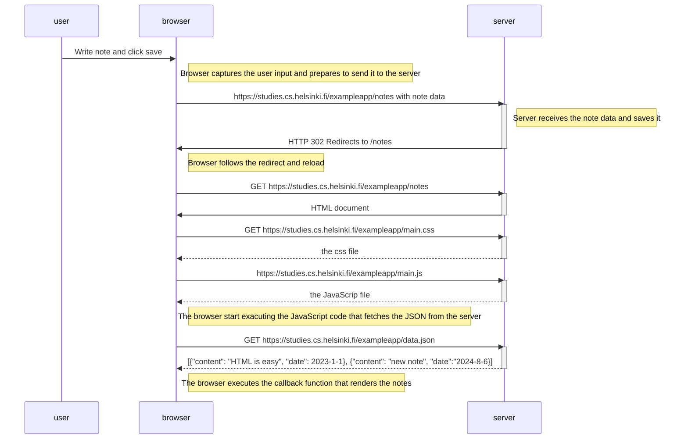

```mermaid
sequenceDiagram
    participant user
    participant browser
    participant server

    user ->>browser: Write note and click save
    Note right of browser: Browser captures the user input and prepares to send it to the server

    browser ->>server: https://studies.cs.helsinki.fi/exampleapp/notes with note data 

    activate server 
    Note right of server: Server receives the note data and saves it
    server ->>browser: HTTP 302 Redirects to /notes 
    deactivate server 

    Note right of browser: Browser follows the redirect and reload

    browser ->>server: GET https://studies.cs.helsinki.fi/exampleapp/notes
    activate server
    server ->>browser: HTML document
    deactivate server

    browser ->>server: GET https://studies.cs.helsinki.fi/exampleapp/main.css
    activate server
    server -->>browser: the css file
    deactivate server

    browser ->>server: https://studies.cs.helsinki.fi/exampleapp/main.js
    activate server
    server -->>browser: the JavaScrip file
    deactivate server

    Note right of browser: The browser start exacuting the JavaScript code that fetches the JSON from the server

    browser->>server: GET https://studies.cs.helsinki.fi/exampleapp/data.json
    activate server
    server -->>browser: [{"content": "HTML is easy", "date": 2023-1-1}, {"content": "new note", "date":"2024-8-6}]
    deactivate server

    Note right of browser: The browser executes the callback function that renders the notes   
```